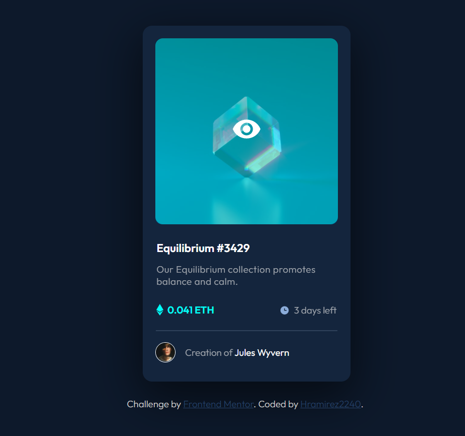

# Frontend Mentor - NFT preview card component solution

This is a solution to the [NFT preview card component challenge on Frontend Mentor](https://www.frontendmentor.io/challenges/nft-preview-card-component-SbdUL_w0U).

## Table of contents

- [Overview](#overview)
  - [The challenge](#the-challenge)
  - [Screenshot](#screenshot)
  - [Links](#links)
  - [Built with](#built-with)
  - [What I learned](#what-i-learned)
  - [Continued development](#continued-development)
  - [Useful resources](#useful-resources)
- [Author](#author)

## Overview

Is a NFT card about the coin ethereum.

### The challenge

Users should be able to:

- View the optimal layout depending on their device's screen size
- See hover states for interactive elements

### Screenshots

### Desktop design


### Desktop active design


### Mobile design (Iphone SE)


### Links

- Solution URL: [Add solution URL here](https://your-solution-url.com)
- Live Site URL: [Github Pages](https://hramirez2240.github.io/NFT-card-component/)

### Built with

- Semantic HTML5 markup
- CSS custom properties
- Flexbox

### What I learned

I learned more about responsive design and combine colors in css to 
create a great combination

This is some of the HTML code that i'm proud of:

```html
<div class="flex-container">
        <div class="card">
            <div class="img-container-equilibrium">
                
                <div class="img-active"></div>
                <div class="view-icon-container">
                    <svg class="view-icon" width="48" height="48" xmlns="http://www.w3.org/2000/svg"><g fill="none" fill-rule="evenodd"><path d="M0 0h48v48H0z"/><path d="M24 9C14 9 5.46 15.22 2 24c3.46 8.78 12 15 22 15 10.01 0 18.54-6.22 22-15-3.46-8.78-11.99-15-22-15Zm0 25c-5.52 0-10-4.48-10-10s4.48-10 10-10 10 4.48 10 10-4.48 10-10 10Zm0-16c-3.31 0-6 2.69-6 6s2.69 6 6 6 6-2.69 6-6-2.69-6-6-6Z" fill="#FFF" fill-rule="nonzero"/></g></svg>
                </div>
            </div>
</div>
```
Some of the css code that i'm proud of (flexbox is very helpful
in this situations):

```css
.flex-container{
    display: flex;
    width: 100%;
    height: 615px;
    justify-content: center;
    margin: 60px 0;
}

.card{
    background-color: #14253D;
    border-radius: 15px;
    width: 330px;
    height: 565px;
    box-shadow: rgba(0, 0, 0, 0.56) 0px 22px 70px 4px;
    
}
```

### Continued development

I want to focuse in flexbox and responsive design, those are good concepts in CSS, and i think it would be more useful in my projects if i learn it.

### Useful resources

- [Flexbox](https://developer.mozilla.org/en-US/docs/Learn/CSS/CSS_layout/Flexbox) - This helps me to understand the basics conceps about flexbox, mozilla is a good web to looking for information about CSS.
- [Active](https://www.w3schools.com/CSSref/sel_active.asp) - This helps me to understand about active state in a css class, very easy and understandable.
- [Media only](https://www.w3schools.com/cssref/css3_pr_mediaquery.asp) - This helps me to understand the concepts about media queries, fundamental when we talk about responsive-design.

## Author

- Github - [Hramirez2240](https://github.com/Hramirez2240)
- Frontend Mentor - [@Hramirez2240](https://www.frontendmentor.io/profile/Hramirez2240)
- Instagram - [@hraamirez](https://www.instagram.com/hraamirez/)